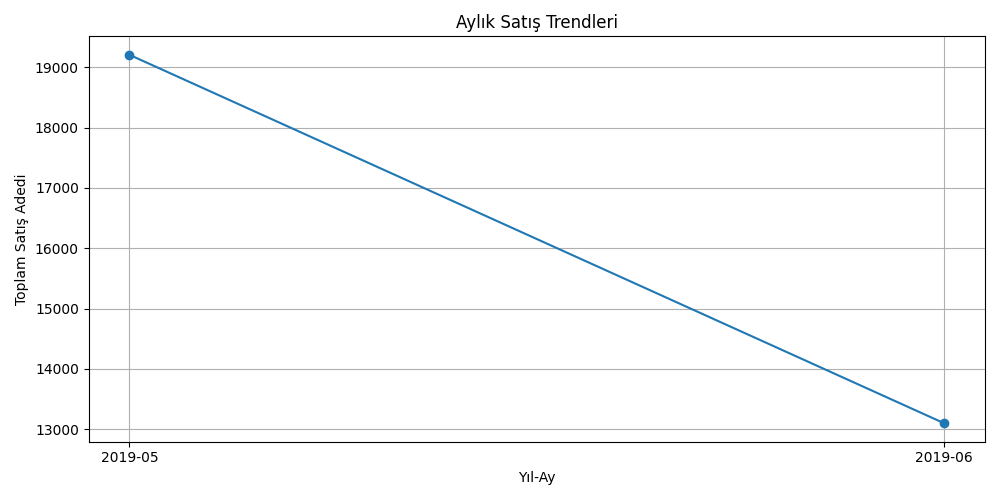
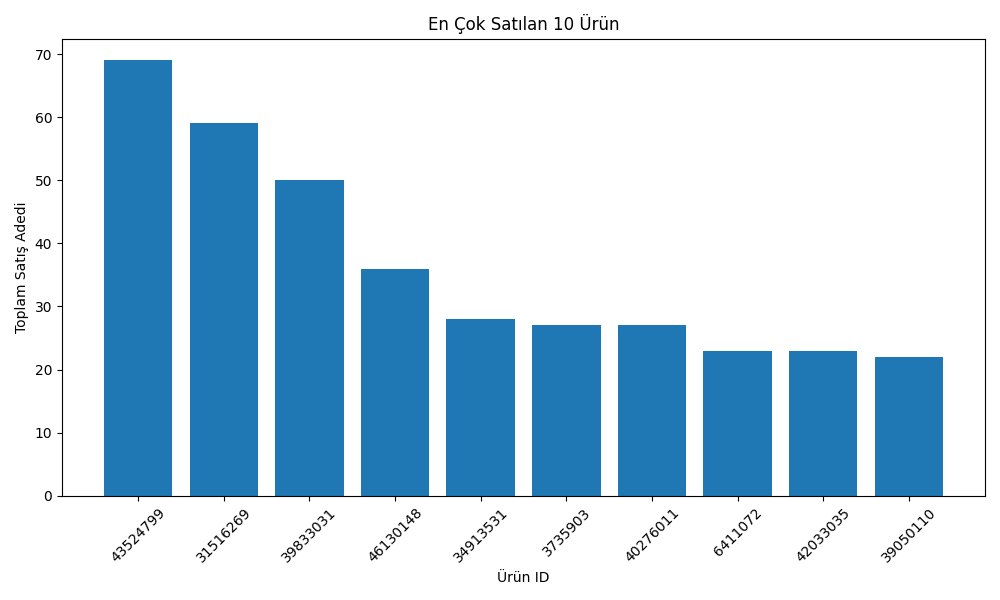

# 🛒 E-Ticaret Satış Veri Analizi

## 🎯 Amaç
Bir e-ticaret sitesine ait satış verilerini analiz ederek **popüler ürünleri**, **satış trendlerini** ve **bölgesel performansı** incelemek.  
Amaç, yönetime **hangi ürünlere ve şehirlere odaklanılması gerektiği** konusunda içgörü sunmaktır.

---

## 📦 Veri Seti
**Kaynak:** [Kaggle - E-commerce Sales Dataset](https://www.kaggle.com/datasets/berkayalan/ecommerce-sales-dataset/data)  
- `customer_details.csv` → Müşteri bilgileri  
- `basket_details.csv` → Sepet ve satış detayları  

---

## 🧰 Kullanılan Kütüphaneler
- pandas  
- numpy  
- matplotlib  

---

## ⚙️ Aşamalar
1. **Veri Yükleme ve Temizleme** → CSV dosyaları okunur, eksik ve hatalı veriler düzeltilir.  
2. **Keşifsel Veri Analizi (EDA)** → En çok satılan ürünler, aktif müşteriler, şehir bazlı satışlar incelenir.  
3. **Veri Görselleştirme** → Satış trendleri ve şehir bazlı dağılım grafikleri oluşturulur.  
4. **Raporlama** → Sonuçlar metin raporu ve CSV formatında kaydedilir.  

---

## 📊 Çıktılar
- 📈 Grafikler → `plots/` klasöründe
- 
- 
- 🧾 Rapor → `report/ecommerce_sales_report.txt`  
- 📁 Sonuç dosyaları → `outputs/` klasöründe  

---

## 🚀 Çalıştırma
```bash
pip install pandas numpy matplotlib
python src/analysis.py
